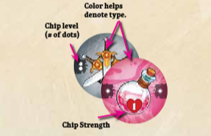
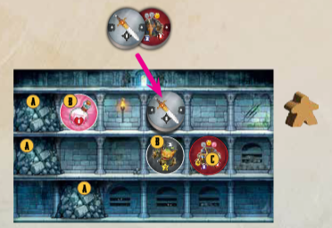

# Fase 1: Mazmorra



Cada ronda comienza con la Fase de Mazmorra, donde se elige una mazmorra e intentas resolver puzles de adyacencia sacando fichas de tu bolsa y colocándolas estratégicamente. Empiezas en el piso superior y bajas de nivel a medida que llenas todos los espacios, sacando y colocando fichas hasta que el piso esté vacío o decidas detenerte.

Una vez completada tu mazmorra, avanza a la Fase de Resolución para determinar el efecto de todas las fichas que jugaste.

**Anatomía de una Mazmorra**

Cada mazmorra tiene pisos (filas de espacios), elementos (que parecen fichas) y obstáculos (que parecen escombros). Las distintas partes de la mazmorra se explican en el siguiente diagrama e indicaciones:



#### Paso 1: Elige un Mapa de Mazmorra 

Cada jugador comienza con su propio mapa de Entrada de Mazmorra. Cada uno debe:

1. Robar un mapa de Entrada de Mazmorra de la parte inferior del mazo.
2. Mirar ambos lados. Poner el que prefieran boca arriba frente a sí.
3. Colocar su figura de héroe al lado del piso superior de su mazmorra.

Cuando todos hayan colocado su Entrada, ¡empieza el juego!



|                                                                                                             1                                                                                                            |                                          2                                          |                                                  3                                                 |
| :----------------------------------------------------------------------------------------------------------------------------------------------------------------------------------------------------------------------: | :---------------------------------------------------------------------------------: | :------------------------------------------------------------------------------------------------: |
| Los **espacios vacíos** no tienen ninguna característica ni obstáculo, y se pueden usar fichas. Algunos tienen ilustraciones llamativas, como antorchas o huesos. Genial, pero no tiene ningún efecto en la jugabilidad. | Los **espacios** están divididos por pilares. Cada planta se compone de 6 espacios. | La **entrada** a la mazmorra.Los mapas muestran una entrada en la parte superior y tienen 3 pisos. |

|                                                        4                                                        |                                                                          5                                                                         |                                                                                                                6                                                                                                               |
| :-------------------------------------------------------------------------------------------------------------: | :------------------------------------------------------------------------------------------------------------------------------------------------: | :----------------------------------------------------------------------------------------------------------------------------------------------------------------------------------------------------------------------------: |
| Un **piso** es una sola fila del mapa de la mazmorra. El piso con tu figura de héroe al lado es tu piso actual. | Los **obstáculos** te impiden jugar fichas en ese espacio. Los efectos a distancia, como armaduras, varitas y arcos, no atraviesan los obstáculos. | Los **mapas de Dungeon Depths** tienen dos pisos y no tienen entrada. Al añadir un mapa de Dungeon Depths, puedes colocarlo justo debajo de la entrada de tu mazmorra o desplazarlo una casilla a la derecha o a la izquierda. |

|                                                                                             7                                                                                            |                                                        8                                                        |                                                                               9                                                                              |
| :--------------------------------------------------------------------------------------------------------------------------------------------------------------------------------------: | :-------------------------------------------------------------------------------------------------------------: | :----------------------------------------------------------------------------------------------------------------------------------------------------------: |
| Las **características de la mazmorra** parecen fichas y tienen el mismo efecto que si se colocara una. Solo las características de los pisos a los que tu Héroe haya llegado te afectan. | Las **características obligatorias** tienen un círculo rojo alrededor. No se pueden jugar fichas en su espacio. | Las **características opcionales** tienen un círculo blanco alrededor. Las fichas se pueden jugar en su espacio, reemplazando el efecto con la ficha jugada. |

<figure><figcaption></figcaption></figure>

***

## PASO 2: JUEGA TU MAZMORRA



Los jugadores simultáneamente sacan fichas de sus bolsas y las colocan
ellos en sus mapas de mazmorras. Los jugadores comienzan en el piso superior,
y una vez lleno descender al siguiente piso. Si un jugador llena
todos los pisos en su mapa de mazmorra, agregan una mazmorra
Mapa de profundidades para profundizar aún más.

1. Saca una ficha de tu cartera y mira ambos lados. Tú eliges de qué lado te gustaría jugar boca arriba.
2. You may only play chips on your current floor.
3. Puedes colocar una ficha en espacios vacíos u opcional
espacios de características, pero no en obstáculos o obligatorios
espacios destacados, o encima de fichas jugadas anteriormente.

<figure><figcaption></figcaption></figure>

Cuando saques la última ficha de tu bolsa, juégala y luego Deténgase inmediatamente (antes de avanzar al siguiente piso).

### DESCENDER

Cada fila de la mazmorra es un piso. Usa tu figura de héroe para Realice un seguimiento de su piso actual.

Terminar un Piso: Un piso está terminado cuando no tiene espacios vacíos. espacios (hay un chip, obstáculo o característica en cada espacio). Cuando un piso está terminado, antes de sacar tu siguiente ficha.Si lo haces, debes elegir entre:

* Continuar: Mueve tu figura de héroe al siguiente piso inferior, y sigue sacando fichas. Sólo puedes continuar si Queda al menos un chip en tu bolso.

* Detener: deja tu figura de héroe en el piso actual y deja de sacar fichas. Has terminado con esta mazmorra. Generalmente es mejor jugar todas tus fichas, así que sólo querrás parar temprano muy raramente.





### ACABANDO EL MAPA

Cuando llenas la última fila de un mapa de mazmorra (Entrada o Profundidades), si te quedan fichas en tu bolsa, saca inmediatamente un nuevo mapa de Dungeon Depths desde la parte inferior de la pila. Elige un lado y colócalo debajo de tu mapa actual. Entonces Realice el resto de los pasos de "Acabado de un piso".

Al colocar un mapa de Dungeon Depths, puedes colocarlo directamente debajo de la entrada de tu mazmorra o muévela un espacio para la izquierda o la derecha, pero una vez colocado no podrás cambiarlo.

## FINAL DE LA FASE DE MAZMORRA

Una vez que todos los jugadores hayan colocado todas sus fichas o se hayan detenido, la fase de Mazmorra termina y comienza la fase de Resolución.

## EJEMPLO DE JUEGO DE MAZMORRA

<figure><figcaption></figcaption></figure>

Nyx (el Pícaro) coloca su mapa de mazmorra y pone su figura al lado del primer piso. Su mazmorra tiene 3 obstáculos (A), 2 opcionales. características (B) y 1 característica obligatoria (C).

Nyx saca su primera ficha. Es una espada/cofre. Deben colocarlo en uno de los espacios en el primer piso, por lo que colocan con la Espada boca arriba sobre la función Monstruo (las espadas golpean ortogonalmente), y adyacente a la función Cofre (que necesita un arma adyacente, moneda y poción para desbloquear).




### &#x20;
