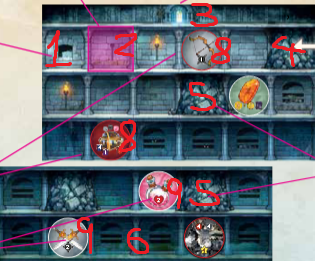

# Fase 1: Mazmorra



Cada ronda comienza con la Fase de Mazmorra, donde se elige una mazmorra e intentas resolver puzles de adyacencia sacando fichas de tu bolsa y colocándolas estratégicamente. Empiezas en el piso superior y bajas de nivel a medida que llenas todos los espacios, sacando y colocando fichas hasta que el piso esté vacío o decidas detenerte.

Una vez completada tu mazmorra, avanza a la Fase de Resolución para determinar el efecto de todas las fichas que jugaste.

**Anatomía de una Mazmorra**

Cada mazmorra tiene pisos (filas de espacios), elementos (que parecen fichas) y obstáculos (que parecen escombros). Las distintas partes de la mazmorra se explican en el siguiente diagrama e indicaciones:



#### Paso 1: Elige un Mapa de Mazmorra 

Cada jugador comienza con su propio mapa de Entrada de Mazmorra. Cada uno debe:

1. Robar un mapa de Entrada de Mazmorra de la parte inferior del mazo.
2. Mirar ambos lados. Poner el que prefieran boca arriba frente a sí.
3. Colocar su figura de héroe al lado del piso superior de su mazmorra.

Cuando todos hayan colocado su Entrada, ¡empieza el juego!



|                                                                                                             1                                                                                                            |                                          2                                          |                                                  3                                                 |
| :----------------------------------------------------------------------------------------------------------------------------------------------------------------------------------------------------------------------: | :---------------------------------------------------------------------------------: | :------------------------------------------------------------------------------------------------: |
| Los **espacios vacíos** no tienen ninguna característica ni obstáculo, y se pueden usar fichas. Algunos tienen ilustraciones llamativas, como antorchas o huesos. Genial, pero no tiene ningún efecto en la jugabilidad. | Los **espacios** están divididos por pilares. Cada planta se compone de 6 espacios. | La **entrada** a la mazmorra.Los mapas muestran una entrada en la parte superior y tienen 3 pisos. |

|                                                        4                                                        |                                                                          5                                                                         |                                                                                                                6                                                                                                               |
| :-------------------------------------------------------------------------------------------------------------: | :------------------------------------------------------------------------------------------------------------------------------------------------: | :----------------------------------------------------------------------------------------------------------------------------------------------------------------------------------------------------------------------------: |
| Un **piso** es una sola fila del mapa de la mazmorra. El piso con tu figura de héroe al lado es tu piso actual. | Los **obstáculos** te impiden jugar fichas en ese espacio. Los efectos a distancia, como armaduras, varitas y arcos, no atraviesan los obstáculos. | Los **mapas de Dungeon Depths** tienen dos pisos y no tienen entrada. Al añadir un mapa de Dungeon Depths, puedes colocarlo justo debajo de la entrada de tu mazmorra o desplazarlo una casilla a la derecha o a la izquierda. |

|                                                                                             7                                                                                            |                                                        8                                                        |                                                                               9                                                                              |
| :--------------------------------------------------------------------------------------------------------------------------------------------------------------------------------------: | :-------------------------------------------------------------------------------------------------------------: | :----------------------------------------------------------------------------------------------------------------------------------------------------------: |
| Las **características de la mazmorra** parecen fichas y tienen el mismo efecto que si se colocara una. Solo las características de los pisos a los que tu Héroe haya llegado te afectan. | Las **características obligatorias** tienen un círculo rojo alrededor. No se pueden jugar fichas en su espacio. | Las **características opcionales** tienen un círculo blanco alrededor. Las fichas se pueden jugar en su espacio, reemplazando el efecto con la ficha jugada. |

<figure><figcaption></figcaption></figure>

***

### &#x20;
