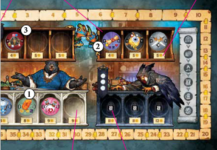

# Fases de Campamento, Ruta y Taberna

<table><thead><tr><th>FASE 3: Campamento</th><th>FASE 4: Ruta</th><th data-hidden></th></tr></thead><tbody><tr><td>
Nuestros héroes regresan a su campamento, donde tienen la oportunidad de subir de nivel antes de emprender el viaje de regreso al pueblo.
<ul><li>Devuelve todas tus fichas a tu bolsa. Coloca tus mapas de mazmorra en la parte superior de las pilas correspondientes.</li><li>Los jugadores muertos reviven con 5 puntos de salud.</li><li>Los jugadores con suficiente XP pueden gastarla para subir de nivel.</li><li>Refresca todas tus habilidades.</li><li>Pasa el marcador de Jugador Inicial en el sentido de las agujas del reloj hasta que llegue al jugador con menos PV (o al primer jugador empatado con menos).</li></ul>

</td><td>Da la vuelta a la siguiente carta de Camino, léela en voz alta y sigue las instrucciones. Consulta la última página de este reglamento para aclaraciones sobre las Cartas de Camino. Si todas las cartas de Camino ya están boca arriba, esta es la ronda final. Omite las fases restantes y pasa al Final de la Partida.</td><td></td></tr></tbody></table>

| Subida de nivel                                                                                                                                                                                                                                                                                                                                                              | FASE 5:  Taberna                                                                                                                                                                                                                                                                                                                                                                                                                                              |
| ---------------------------------------------------------------------------------------------------------------------------------------------------------------------------------------------------------------------------------------------------------------------------------------------------------------------------------------------------------------------------- | ------------------------------------------------------------------------------------------------------------------------------------------------------------------------------------------------------------------------------------------------------------------------------------------------------------------------------------------------------------------------------------------------------------------------------------------------------------- |
| Comienzas en el nivel cero. Durante la fase de Campamento, puedes subir de nivel tantas veces como te sea posible. Para hacerlo, gasta la cantidad de PX indicada en el siguiente nivel de tu árbol de habilidades. Elige una de las habilidades disponibles de tu nuevo nivel. Colócala junto a tu tablero de jugador y pon la otra boca abajo para indicar tu nuevo nivel. | 
Después de regresar al pueblo, el jugador con más PV es inundado de peticiones por parte de los nobles. Mientras tanto, los demás aventureros se dirigen a la taberna local para trabajar y descansar de cara al viaje que les espera.

Por cada icono de jarra entre la ficha del líder y tu ficha en el marcador de PV, puedes elegir ganar 2 monedas de oro o recuperar 1 punto de salud, combinando y alternando las opciones como prefieras.
 |

***

<figure><figcaption></figcaption></figure>

**Dondarion tiene 15 PX al inicio de la Fase de Campamento.**

1. Ya ha desbloqueado una habilidad de nivel 1, por lo que el siguiente nivel que puede desbloquear es el 2. Gasta 6 PX.
2. Elige una de las dos habilidades de nivel 2 y pone la otra boca abajo.
3. Todavía tiene suficientes PX para subir de nivel otra vez, así que gasta 8 más y elige una de sus habilidades de nivel 3.

***

| FASE 6: Aldea                                                                                                                                                                                                                                                                                                                                                                                                                                                                                                                                                                                                                                                                                                                                                                                                                                                                                                                     | ACCIONES EN LA TIENDA                                                                                                                                                                                                                                                                                                                                                                                                                                                                                                                                                                                                                                                                                                                                                                                                                                                                                                                                                                                                                                                                                                                                                                                                                                                                                                                                                                                                                                                                |
| --------------------------------------------------------------------------------------------------------------------------------------------------------------------------------------------------------------------------------------------------------------------------------------------------------------------------------------------------------------------------------------------------------------------------------------------------------------------------------------------------------------------------------------------------------------------------------------------------------------------------------------------------------------------------------------------------------------------------------------------------------------------------------------------------------------------------------------------------------------------------------------------------------------------------------- | ------------------------------------------------------------------------------------------------------------------------------------------------------------------------------------------------------------------------------------------------------------------------------------------------------------------------------------------------------------------------------------------------------------------------------------------------------------------------------------------------------------------------------------------------------------------------------------------------------------------------------------------------------------------------------------------------------------------------------------------------------------------------------------------------------------------------------------------------------------------------------------------------------------------------------------------------------------------------------------------------------------------------------------------------------------------------------------------------------------------------------------------------------------------------------------------------------------------------------------------------------------------------------------------------------------------------------------------------------------------------------------------------------------------------------------------------------------------------------------ |
| 
Comenzando por el jugador inicial y continuando en el sentido de las agujas del reloj, los jugadores se turnan para comprar. En cada turno, un jugador puede comprar una nueva ficha en una tienda abierta o visitar una de las tiendas especiales. La fase termina cuando todos los jugadores han tomado 3 turnos.

<h4>Tiendas de fichas</h4>
Hay 4 tiendas de fichas diferentes en la aldea: dos tiendas de nivel 1, una tienda de nivel 2 y una tienda de nivel 3. La tienda de nivel 3 comienza la partida cerrada y se abre en la ronda 2. Las tiendas ofrecen fichas del nivel correspondiente. Los jugadores no pueden mirar el reverso de las fichas en las tiendas.

Al inicio de la fase de Aldea, llena cada espacio vacío en las tiendas abiertas tomando fichas del nivel correspondiente de la parte inferior de esa pila y colocándolas en las tiendas <strong>sin mirar el reverso</strong>.
 | <h4>Visitar una tienda especial</h4>
En lugar de comprar una ficha, puedes visitar una de las otras tres tiendas. Para hacerlo, paga los costes requeridos y recibe la recompensa. Solo puedes obtener la recompensa una vez por visita, pero puedes visitar la misma tienda más de una vez en la fase.
<ul><li><strong>Equipo de Gurdy:</strong> Obtén 2 herramientas de tu elección por 1 oro, o 3 herramientas de tu elección por 2 de oro.</li><li><strong>Choza de la Sanadora:</strong> Recupera 1 punto de salud gratis y puedes pagar 1 oro para recuperar 1 punto de salud adicional. Lo máximo que puedes curar en una visita es 2 de salud.</li><li><strong>Taberna de Pterry:</strong> Gana 2 de oro y 1 herramienta Antorcha.</li></ul>
<h4>Comprar una ficha</h4>
Elige una ficha, paga a la reserva la cantidad de oro indicada en la etiqueta de precio y coloca la ficha en tu bolsa. Puedes mirar ambos lados de la ficha después de comprarla.
<blockquote>
Nota: Cada Héroe recibe un descuento en ciertos tipos de fichas, pero <strong>solo si el lado visible coincide con el tipo con descuento</strong>.
</blockquote>
Si la ficha comprada era la última de la tienda, repón todos los espacios vacíos en <strong>todas las tiendas abiertas</strong>, no solo en la tienda donde compraste (no descartes ninguna ficha). En caso contrario, <strong>no rellenes</strong> los espacios vacíos de las tiendas después de la compra.
 |
| 

<h4>Un turno de Aldea</h4>
Durante tu turno en la Aldea puedes realizar <strong>una acción de exploración</strong> y luego <strong>una acción de compra</strong>.

<h4>Acciones de Exploración</h4>
Puedes elegir una de las dos acciones de exploración:
<ol><li>
<strong>Ojear una ficha:</strong> Mira en secreto el reverso de una ficha y luego vuelve a colocarla con el lado que prefieras hacia arriba.
<blockquote>
Nota: No estás obligado a comprar esa ficha después de ojearla.
</blockquote></li><li><strong>Reabastecer una tienda:</strong> Descarta cualquier herramienta para retirar todas las fichas de una tienda y volver a llenarla. Coloca las fichas retiradas encima de una pila existente de ese mismo nivel.</li></ol>                                                                                                                                                  | <h4>Comprar una ficha</h4>
Elige una ficha, paga a la reserva la cantidad de oro indicada en la etiqueta de precio y coloca la ficha en tu bolsa. Puedes mirar ambos lados de la ficha después de comprarla.
<blockquote>
Nota: Cada Héroe recibe un descuento en ciertos tipos de fichas, pero <strong>solo si el lado visible coincide con el tipo con descuento</strong>.
</blockquote>
Si la ficha comprada era la última de la tienda, repón todos los espacios vacíos en <strong>todas las tiendas abiertas</strong>, no solo en la tienda donde compraste (no descartes ninguna ficha). En caso contrario, <strong>no rellenes</strong> los espacios vacíos de las tiendas después de la compra.
                                                                                                                                                                                                                                                                                                                                                                                                                                                                                                                                                                                                                                                                                                                                                              |
|                                                                                                                                                                                                                                                                                                                                                                                                                                                                                                                                                                                                                                                                                                                                                                                                                                                                                                                                   | <h4>Fin de la Fase de Aldea</h4>
La Fase de Aldea termina cuando cada jugador ha tomado 3 turnos.
                                                                                                                                                                                                                                                                                                                                                                                                                                                                                                                                                                                                                                                                                                                                                                                                                                                                                                                                                                                                                                                                                                                                                                                                                                                                                                                                                                              |

***

<figure><figcaption></figcaption></figure>

| 
<strong>1.</strong> Nyx comienza su 1er turno de Aldea con 11 de oro. Usa su acción de Exploración para ojear la ficha de Gema de Nivel 2 y ve que en el reverso hay una Moneda. Devuelve la ficha al espacio con el lado de Moneda hacia arriba. Nyx usa su acción de Tienda para comprar esa ficha. Nyx empieza con la habilidad <em>Sabueso del Tesoro</em>, que le da un descuento de 1 oro en fichas de Moneda, así que paga 7 por ella, quedándose con 4 de oro. Luego pasa el turno al siguiente jugador. Nyx no repone el espacio de donde compró la ficha.

<strong>2.</strong> En su 2º turno, Nyx ojea la ficha de Artefacto, con la esperanza de encontrar otra Moneda con descuento. Es un Escudo, así que la devuelve con el lado de Artefacto hacia arriba (para que los demás jugadores no tengan esa información). Para su acción de Tienda, Nyx visita la Choza de la Sanadora. Recupera 1 punto de salud gratis y paga 1 de oro para recuperar 1 punto de salud adicional, quedándose con 3 de oro.

<strong>3.</strong> En su turno final, Nyx ojea la ficha de Poción de Nivel 2. No puede permitírsela, pero la información puede ser útil para la siguiente fase de Aldea. Con su descuento, puede comprar la ficha de Cofre en la tienda de Nivel 1. Como ahora una tienda ha quedado completamente vacía, al final de su turno repone todos los espacios vacíos en el tablero de Aldea (excepto los de Nivel 3, ya que esa tienda no se abrirá hasta la próxima ronda).
 |
| -------------------------------------------------------------------------------------------------------------------------------------------------------------------------------------------------------------------------------------------------------------------------------------------------------------------------------------------------------------------------------------------------------------------------------------------------------------------------------------------------------------------------------------------------------------------------------------------------------------------------------------------------------------------------------------------------------------------------------------------------------------------------------------------------------------------------------------------------------------------------------------------------------------------------------------------------------------------------------------------------------------------------------------------------------------------------------------------------------------------------------------------------------------------------------------------------------------------------------------------------------------------------------------------------------------------------------------------------------------------------------------------------------------------------------------------------------------------------------------------------------------------------- |

***

## FIN DEL JUEGO

La partida termina durante la Fase de Camino cuando ya no quedan más cartas de Camino por revelar.

* 🏅 Gana **3 PV por cada habilidad** que hayas desbloqueado.
* 🏅 Suma tu Salud, PX y Oro. Por cada 5 del total combinado, ganas **1 PV**.

**Ejemplo:** Nyx desbloqueó 3 habilidades, así que gana 9 PV. Nyx también tiene 7 de oro, 4 PX y 2 de salud, para un total de 13. Nyx gana 2 PV, ignorando el resto.

El jugador con más Puntos de Valor (PV) gana la partida.\
En caso de empate, gana el jugador con más oro.\
Si persiste el empate, los jugadores empatados comparten la victoria.
