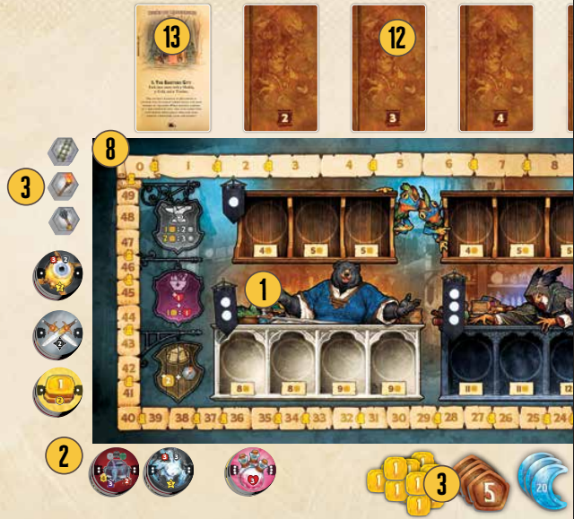

# Organización del juego

# Setup

## A. Game setup
1. Place the Market Board in the center of the table.  
2. Place the tier 1, 2, and 3 chips (marked with 1, 2 or 3 dots) in randomized piles of the same tier.  
3. Place the gold tokens and Tool tokens next to the Market Board.  
4. Shuffle the Dungeon Entrance Maps and Dungeon Depths Maps separately and place each stack within easy reach of all players.  
5. Give the first player token to a randomly selected player.  

---

## B. Player setup
Determine which hero each player is playing (randomly or by choice).

Each Player:
6. Take the Hero Board, skill reference, and the 10 starting chips (marked with their Hero’s symbol). Take the bag that matches your hero's color.  
7. Place one health tracker and one XP tracker on the zero space of your tracks.  
8. Place your VP token on the 0 (zero) space of the VP track on the Market Board.  

---

### What's special about my hero?
Each hero starts with a few extra chips in their Satchel:

- **Fighter** – Sword and Shield  
- **Rogue** – Coin and Bow  
- **Alchemist** – Potion and Staff  
- **Wizard** – Coin and Staff  

In addition, each Hero has 2 unique starting skills, and 12 level up skills.  